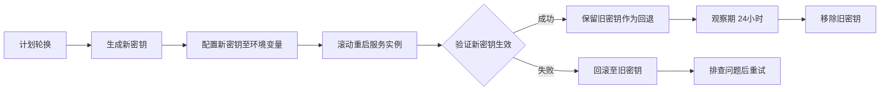

# 密钥轮换策略

> **文档版本**: v1.0  
> **最后更新**: 2026-07-01  
> **适用范围**: AI数字名片后端服务

---

## 1. 概述

密钥轮换（Key Rotation）是密码学安全的基础实践。定期更换加密密钥和签名密钥可以限制单次泄露造成的损害范围，并满足合规审计要求。

本文档定义了 AI数字名片 项目中所有密钥的轮换周期、流程和应急响应方案。

---

## 2. 密钥清单

| 密钥名称 | 用途 | 算法 | 存储位置 | 轮换周期 |
|---|---|---|---|---|
| `JWT_SECRET` | JWT Token 签名/验签 | HMAC-SHA256 | 环境变量 /.env | **90天** |
| `WECHAT_PAY_API_KEY` | 微信支付 API V2 签名 | MD5 | 环境变量 /.env | **180天** |
| `WECHAT_PAY_V3_KEY` | 微信支付 API V3 签名 | AES-256-GCM | 环境变量 /.env | **180天** |
| `ALIPAY_PRIVATE_KEY` | 支付宝请求签名 | RSA2 | 环境变量 / 文件 | **365天** |
| `ALIPAY_PUBLIC_KEY` | 支付宝响应验签 | RSA2 | 环境变量 / 文件 | **365天** |
| `DEEPSEEK_API_KEY` | AI 服务调用 | API Key | 环境变量 /.env | **按需轮换** |
| `CHAINKE_AUTH_TOKEN` | 链客宝对接认证 | Bearer Token | 环境变量 /.env | **90天** |
| `WECHAT_MINI_SECRET` | 微信小程序登录 | OAuth Secret | 环境变量 /.env | **180天** |
| `SSO_*_CLIENT_SECRET` | SSO/OAuth2 Client Secret | OAuth2 | 环境变量 /.env | **180天** |
| Database Connection | 数据库连接凭证 | 用户名+密码 | 环境变量 /.env | **180天** |
| `SENTRY_DSN` | 错误监控 | DSN Token | 环境变量 /.env | **按需轮换** |

> **注**: Redis 密码（`REDIS_PASSWORD`）等基础设施凭证的轮换策略由运维团队定义，不在本文档范围内。

---

## 3. 轮换周期说明

### 3.1 JWT_SECRET — 90天
JWT 用于用户认证会话，泄露风险最高。90天轮换可在安全性与运维成本间取得平衡。

### 3.2 支付密钥 — 180天
支付密钥受支付平台侧风控保护，泄露概率较低。180天轮换满足 PCI DSS 合规要求。

### 3.3 第三方 API Key — 按需轮换
DeepSeek / SSO / 链客宝等 API Key 由外部服务商管理，轮换需配合对方平台操作。建议：
- 至少每 180 天检查一次
- 发现异常访问立即轮换
- 利用服务商提供的多 Key 支持实现零停机轮换

---

## 4. 轮换流程

### 4.1 常规轮换流程（计划内）



**详细步骤**:

1. **通知团队**: 通过企业通讯工具提前 48 小时发布轮换通知。
2. **生成新密钥**: 
   - JWT_SECRET: `openssl rand -hex 32` (256位)
   - 支付密钥: 在对应商户平台重新生成
3. **双 Key 过渡期**:
   - JWT 验证端同时接受新旧两个密钥签名（见 4.3 节）
   - 新签发的 Token 使用新密钥
   - 旧 Token 在有效期内仍可被旧密钥验证
4. **部署配置**: 更新目标环境的 `.env` 或环境变量。
5. **滚动重启**: 逐一重启所有服务实例，避免全量停机。
6. **健康检查**: 验证 API 响应正常，监控无 401/403 异常飙升。
7. **观察期**: 保持旧密钥可用 24 小时（或 JWT Token 最大有效期）。
8. **清理**: 确认无误后移除旧密钥配置。

### 4.2 紧急轮换流程（泄露事件）

当检测到密钥泄露或疑似泄露时，立即执行：

1. **立即生成新密钥**并部署（跳过双 Key 过渡期，除非业务无法接受）。
2. **吊销受影响的所有 Token**: 调用 Token 黑名单接口使现有 JWT 失效。
3. **通知安全团队**: 记录事件时间、影响范围、处理措施。
4. **审计日志核查**: 检查泄露时间窗口内的异常访问记录。
5. **事后复盘**: 分析泄露原因，更新安全策略。

### 4.3 JWT 双密钥过渡期实现

```python
# 验证时尝试新旧两个密钥
def decode_token(token: str) -> dict:
    try:
        return jwt.decode(token, settings.JWT_SECRET, algorithms=[settings.ALGORITHM])
    except JWTError:
        # 若新密钥验证失败，尝试旧密钥（过渡期支持）
        if hasattr(settings, "JWT_SECRET_OLD") and settings.JWT_SECRET_OLD:
            return jwt.decode(token, settings.JWT_SECRET_OLD, algorithms=[settings.ALGORITHM])
        raise
```

> **说明**: 当前项目暂未实现双密钥过渡机制。上述代码为推荐实现方案，需在轮换前合并到代码库。

---

## 5. 密钥生成规范

| 密钥类型 | 最小长度 | 推荐算法 | 生成命令 |
|---|---|---|---|
| JWT_SECRET | 256位 (32字节) | HMAC-SHA256 | `openssl rand -hex 32` |
| API Key / Token | 128位 (16字节) | 随机字符串 | `openssl rand -base64 32` |
| RSA 私钥 | 2048位 | RSA-OAEP | `openssl genpkey -algorithm RSA -pkeyopt rsa_keygen_bits:2048` |
| AES 密钥 | 256位 | AES-256-GCM | `openssl rand -hex 32` |

---

## 6. 职责分工

| 角色 | 职责 |
|---|---|
| **后端开发组** | 实现双密钥过渡机制、Token 黑名单接口 |
| **DevOps/运维** | 管理环境变量、执行密钥部署、监控密钥过期时间 |
| **安全团队** | 制定轮换策略、监督执行、事件响应 |
| **技术负责人** | 审批轮换计划、协调跨团队沟通 |

> **注**: 当前项目无独立安全团队，相关职责由技术负责人兼管。

---

## 7. 监控与告警

### 7.1 指标采集
- `jwt_secret_age_days`: JWT_SECRET 已使用天数
- `key_rotation_overdue`: 是否超过轮换期限（1=是, 0=否）

### 7.2 告警规则

| 告警名称 | 条件 | 严重级别 | 通知方式 |
|---|---|---|---|
| 密钥超期未轮换 | `jwt_secret_age_days >= 90` | Warning | 企业微信 Bot |
| 密钥超期30天+ | `jwt_secret_age_days >= 120` | Critical | 企业微信 + 电话 |
| 支付密钥超期 | 对应密钥 `age_days >= 180` | Critical | 企业微信 Bot |

### 7.3 过期提醒日历
建议在团队共享日历中添加密钥轮换提醒，提前 **14天** 发出预警：

```
JWT_SECRET 轮换提醒 (到期: YYYY-MM-DD)
WECHAT_PAY_API_KEY 轮换提醒 (到期: YYYY-MM-DD)
...
```

---

## 8. 附录

### A. 轮换检查清单

- [ ] 已生成新密钥并验证可用性
- [ ] 已更新所有受影响的 `.env` 和环境变量
- [ ] 已部署双密钥过渡代码（如适用）
- [ ] 已重启服务并验证健康检查通过
- [ ] 已观察 24 小时无异常
- [ ] 已移除旧密钥
- [ ] 已更新文档和轮换记录

### B. 轮换记录表

| 日期 | 密钥名称 | 操作人 | 原因 | 备注 |
|---|---|---|---|---|
| | | | | |

### C. 参考标准
- **PCI DSS v4.0**: 加密密钥至少每 12 个月轮换一次
- **NIST SP 800-57**: 对称密钥有效期一般不超过 2 年
- **OWASP Key Management Cheat Sheet**: 建议生产环境每 90 天轮换 HMAC 密钥
