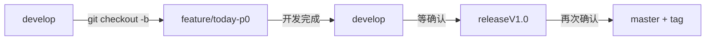
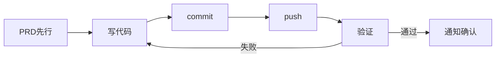

# AI数字名片 — AI能力注入 P0 PRD

> **蜂巢会议共识输出: 乘黄产品规划 × 烛龙技术评估**
> 版本: v1.0 | 日期: 2026-07-05 | 状态: 待开发
> 分支: `develop` → `feature/today-p0` → `develop`

---

## 目录

1. [背景与目标](#1-背景与目标)
2. [优先级定义 (P0/P1/P2/P3)](#2-优先级定义)
3. [P0 范围详述](#3-p0-范围详述)
4. [风险登记册](#4-风险登记册)
5. [技术方案](#5-技术方案)
6. [模块依赖关系](#6-模块依赖关系)
7. [开发计划与里程碑](#7-开发计划与里程碑)
8. [验收标准](#8-验收标准)
9. [开发纪律](#9-开发纪律)

---

## 1. 背景与目标

### 1.1 背景

AI数字名片项目已完成后端20+ AI模块的开发（WritingAssistant / RAG / 向量搜索 / 知识图谱等），但前端小程序与后端AI能力之间存在**严重的断连**：

- 前端 `api.js` 调用 `/api/ai/write` 和 `/api/ai/generate`——但后端实际路由为 `/api/ai/assist/write`
- `ai/` 目录下所有JS文件为**0字节空存根**
- Mock模式当前为关闭状态（`MockService.USE_MOCK=false`），后端未运行时前端全挂

本次P0的目标是**打通前端到后端AI能力的注入链路**，使AI名片生成、AI聊天、隐私协议、用户协议四个核心功能可用。

### 1.2 目标

| 维度 | 目标 |
|:-----|:-----|
| 产品 | 用户可完成AI辅助写名片 + AI聊天咨询 + 查看隐私/用户协议 |
| 技术 | 前端Mock/Real双模式可用，API路径对齐后端真实路由 |
| 质量 | 核心链路e2e跑通，无阻塞性错误 |

---

## 2. 优先级定义

| 优先级 | 模块 | 说明 | 预估工时 |
|:-------|:-----|:-----|:---------|
| **P0** | `ai/chat` | AI聊天（复用 RAGPipeline） | 4h |
| **P0** | `ai/generate` | AI生成名片（复用 WritingAssistant） | 3h |
| **P0** | `agreement/privacy` | 隐私协议页面 | 1h |
| **P0** | `agreement/user` | 用户协议页面 | 1h |
| **P1** | `ai/index` | AI聚合入口页 | 2h |
| **P2** | `ai/abtest` + `ai/feedback` | AB测试 + 用户反馈 | 4h |
| **P3** | `ai/gaia` + `ai/modelserve` | 全局AI代理 + 模型服务 | 待定 |

> **P0 合计工时**: 9h（不含测试验证）
> P1-P3 本次不做，仅记录规划

---

## 3. P0 范围详述

### 3.1 ai/chat — AI聊天

| 属性 | 值 |
|:-----|:---|
| 路由 | `/pages/ai/chat/index` |
| 后端端点 | `POST /api/ai/rag`（RAGPipeline） |
| 前端资源 | wxss 已就绪(4.3KB)，js/wxml/json 需从零补 |
| 分包 | `ai/` |

**功能描述**:
- 用户可输入自然语言提问（如"帮我润色这段个人简介"）
- 前端调用 `/api/ai/rag`，后端通过 RAGPipeline + DeepSeek API 进行回答
- 对话界面使用已就绪的聊天样式
- Mock模式下返回预设示例数据

### 3.2 ai/generate — AI生成名片

| 属性 | 值 |
|:-----|:---|
| 路由 | `/pages/ai/generate/index` |
| 后端端点 | `POST /api/ai/assist/write`（WritingAssistant） |
| 迁移来源 | `liankebao-weapp` 中的 `cardApi.generate` 调用逻辑 |
| 分包 | `ai/` |

**功能描述**:
- 用户输入个人信息（姓名、职位、公司、简介等）
- 前端调用 `/api/ai/assist/write`，后端 WritingAssistant 通过 DeepSeek API 生成名片文案
- 支持多轮润色优化
- 生成结果可预览并保存

### 3.3 agreement/privacy — 隐私协议

| 属性 | 值 |
|:-----|:---|
| 路由 | `/pages/agreement/privacy/index` |
| 分包 | `agreement/` |
| 前端资源 | wxss 已就绪(1KB)，js/wxml/json 需从零补 |

**功能描述**:
- 展示完整的隐私协议内容
- 符合合规要求的标准协议页面

### 3.4 agreement/user — 用户协议

| 属性 | 值 |
|:-----|:---|
| 路由 | `/pages/agreement/user/index` |
| 分包 | `agreement/` |
| 前端资源 | wxss 已就绪(1KB)，js/wxml/json 需从零补 |

**功能描述**:
- 展示完整的用户协议内容
- 与隐私协议共用相似页面结构

### 3.5 分包结构

```
分包: ai/ (7页)
  ├── chat/index         ← P0
  ├── generate/index     ← P0
  ├── index/index        ← P1
  ├── abtest/index       ← P2
  ├── feedback/index     ← P2
  ├── gaia/index         ← P3
  └── modelserve/index   ← P3

分包: agreement/ (2页)
  ├── privacy/index      ← P0
  └── user/index         ← P0

分包: platform/ (1页)
  └── index/index        ← 待定
```

---

## 4. 风险登记册

蜂巢会议中烛龙技术评估识别出以下风险：

| 编号 | 风险等级 | 风险描述 | 影响 | 缓解措施 |
|:-----|:---------|:---------|:-----|:---------|
| **R1** | 🔴 阻塞 | 前端 `api.js` 调用 `/api/ai/write` 和 `/api/ai/generate`，后端实际路由为 `/api/ai/assist/write` | API 404，功能全挂 | 前端对齐后端路由，或用 Mock 过渡 |
| **R2** | 🔴 阻塞 | 8202 AI微服务未验证运行状态，且缺独立 Dockerfile | 无法部署后端AI服务 | 验证后端服务状态；补充 Dockerfile |
| **R3** | 🔴 阻塞 | `ai/` 下所有JS文件为0字节（空存根） | 页面白屏 | 全部重新实现 |
| **R4** | 🟡 警告 | `ai/chat` 无对应后端chat端点 | 聊天功能不可用 | 复用 `/api/ai/rag` 作为chat端点 |
| **R5** | 🟡 警告 | DeepSeek API key 需要确认 | 后端调用第三方AI失败 | 向海容确认key状态；Mock模式兜底 |
| ✅ | 已确认 | v2.2.0 标签已存在 | — | 基于此标签可部署 |

### 4.1 Mock兜底策略

在解决所有🔴风险之前，**Mock模式是前端独立开发的保障**：

```
MockService.USE_MOCK = false  (当前) →  true (开发期) →  false (联调上线)
                          ↓                    ↓                    ↓
                    后端未起全挂          前端可独立开发       真实后端已就绪
```

**Mock模式切换位置**: `mock/index.js` 中的 `USE_MOCK` 常量

---

## 5. 技术方案

### 5.1 MockService 配置

| 阶段 | `USE_MOCK` | 说明 |
|:-----|:-----------|:-----|
| 开发期 | `true` | 前端独立开发，不依赖后端 |
| 联调 | `false` | 连接真实后端进行e2e测试 |
| 上线 | `false` | 生产环境使用真实后端 |

### 5.2 API 路由映射

| 前端功能 | 前端调用 | 后端真实路由 | 后端服务 |
|:---------|:---------|:-------------|:---------|
| AI生成名片 | `/api/ai/generate` | `POST /api/ai/assist/write` | WritingAssistant → DeepSeek API |
| AI聊天 | `/api/ai/chat` | `POST /api/ai/rag` | RAGPipeline → DeepSeek API |

**方案**: 在 `api.js` 或请求拦截层做路由转换，使得前端逻辑保持语义化的 `/api/ai/generate` 和 `/api/ai/chat`，底层自动映射到后端真实路由。

### 5.3 liankebao-weapp 迁移策略

| 可复用 | 不可复用 | 策略 |
|:-------|:---------|:-----|
| `cardApi.scan`, `cardApi.generate`, `matchApi`, `growth` 模块的**API调用逻辑**(`client.ts`) | 所有组件代码 | 仅移植 `client.ts` → `request.js` 中的请求逻辑 |
| — | UI组件 | 全部重写（微信小程序原生框架） |

### 5.4 数据流架构

```
[微信小程序]
    ↓ 语义化API (ai/generate, ai/chat)
[前端请求层 api.js]
    ↓ 路由映射 (generate → assist/write, chat → rag)
[后端 AI 微服务 :8202]
    ↓
[WritingAssistant / RAGPipeline]
    ↓
[DeepSeek API (外部)]      ← 依赖 API Key (R5)
```

### 5.5 关键依赖

| 依赖项 | 状态 | 负责人 |
|:-------|:-----|:-------|
| DeepSeek API Key | 🟡 待确认 | 向海容 |
| 后端8202服务运行 | 🔴 待验证 | 烛龙 |
| 后端Dockerfile | 🔴 待补充 | 烛龙 |
| v2.2.0 标签 | ✅ 已就绪 | — |

---

## 6. 模块依赖关系

```
P0 整体 → 无外部模块依赖（可完全在Mock模式下独立开发）
         │
         ├── ai/generate → liankebao-weapp (API逻辑迁移)
         ├── ai/chat     → 无 (wxss已就绪)
         ├── agreement/privacy → 无 (wxss已就绪)
         └── agreement/user    → 无 (wxss已就绪)
```

**注意**: 4个P0模块之间无相互依赖，可**并行开发**。

---

## 7. 开发计划与里程碑

### 7.1 分支策略



### 7.2 开发顺序

| 序号 | 模块 | 工时 | 前置条件 | 说明 |
|:-----|:-----|:-----|:---------|:-----|
| 1 | MockService 配置 | 0.5h | 无 | 先切 `USE_MOCK=true`，解耦后端依赖 |
| 2 | `agreement/privacy` | 1h | Mock就绪 | 最快出成果，验证分包结构 |
| 3 | `agreement/user` | 1h | #2完成 | 复用privacy的页面结构 |
| 4 | `ai/generate` | 3h | Mock就绪 | 核心功能，需从liankebao迁移API逻辑 |
| 5 | `ai/chat` | 4h | Mock就绪 | 聊天交互最复杂，最后攻坚 |
| 6 | e2e验证 | 1h | #1-#5完成 | 全链路验证，切换Mock=false |
| 7 | 风险解决 | 并行 | — | R1-R5同步跟进 |

### 7.3 里程碑

| 里程碑 | 时间 | 交付物 |
|:-------|:-----|:-------|
| M1: Mock模式切通 | 开发首日 | `USE_MOCK=true`，前端不依赖后端 |
| M2: 4个P0页面完成 | 开发第1-2日 | chat/generate/privacy/user 全部可渲染 |
| M3: Mock-Real切换验证 | 开发第2日 | 后端联调通过，Mock=false工作正常 |
| M4: PR合并develop | 验证通过后 | PR merged to develop |

---

## 8. 验收标准

### 8.1 功能验收

| # | 验收项 | 预期结果 |
|:--|:-------|:---------|
| F1 | AI生成名片页面正常加载 | 页面渲染无白屏，输入表单可见 |
| F2 | AI生成调用成功 (Mock) | 返回预设mock数据，生成结果展示 |
| F3 | AI生成调用成功 (Real) | 调用 `/api/ai/assist/write` 成功返回 |
| F4 | AI聊天页面正常加载 | 聊天界面渲染，输入框可交互 |
| F5 | AI聊天发送消息 (Mock) | Mock回复正常展示 |
| F6 | AI聊天发送消息 (Real) | 调用 `/api/ai/rag` 成功返回 |
| F7 | 隐私协议页面可访问 | 协议内容全文展示，可滚动 |
| F8 | 用户协议页面可访问 | 协议内容全文展示，可滚动 |

### 8.2 技术验收

| # | 验收项 | 预期结果 |
|:--|:-------|:---------|
| T1 | Mock/Real切换 | `USE_MOCK` 切换后功能正常 |
| T2 | 路由映射正确 | `/api/ai/generate` → `/api/ai/assist/write` |
| T3 | 路由映射正确 | `/api/ai/chat` → `/api/ai/rag` |
| T4 | 分包结构 | `ai/(7页)` + `agreement/(2页)` 分包正确 |
| T5 | 0字节文件清零 | `ai/` 下所有文件有实际内容 |

### 8.3 风险验收

| # | 风险项 | 验收标准 |
|:--|:-------|:---------|
| R1 | 路由对齐 | 前端不再调用不存在的后端端点 |
| R2 | 后端服务 | 8202端口AI微服务可访问 |
| R3 | 空存根清除 | 所有JS文件非0字节 |
| R4 | 聊天端点 | chat映射到rag端点 |
| R5 | DeepSeek Key | Key有效，或Mock下降级提示 |

---

## 9. 开发纪律

### 9.1 闭环节点



### 9.2 分支规范

- 基础分支: `develop`
- 开发分支: `feature/today-p0`
- 合并目标: 验证后合并回 `develop`
- 上线路径: `develop` → `releaseV1.0` → `master` (经确认)

### 9.3 Commit 规范

| 类型 | 使用场景 | 示例 |
|:-----|:---------|:-----|
| `feat:` | 新增功能页 | `feat: 实现ai/chat页面` |
| `fix:` | 修复问题 | `fix: 修复api路由映射错误` |
| `refactor:` | 重构代码 | `refactor: 抽离MockService配置` |
| `docs:` | 文档修改 | `docs: 更新AI能力注入PRD` |

### 9.4 质量门禁

- [ ] 所有JS文件非0字节
- [ ] Mock模式可用（`USE_MOCK=true`）
- [ ] 4个P0页面均可渲染
- [ ] 无硬编码后端地址
- [ ] commit → push 完整链路

---

## 附录

### A. 名词解释

| 术语 | 说明 |
|:-----|:-----|
| 乘黄 | 产品角色/负责人 |
| 烛龙 | 技术架构/评估角色 |
| 蜂巢会议 | 产品+技术协同决策会议 |
| WritingAssistant | 后端AI文案生成模块，输出→DeepSeek API |
| RAGPipeline | 后端检索增强生成管道，输出→DeepSeek API |
| MockService | 前端模拟数据服务，使开发不依赖后端 |
| liankebao-weapp | 可复用API调用逻辑的存量代码库 |

### B. 参考文档

- [全自动版本开发协议](../../全自动版本开发协议.md)
- [开发版本管理最佳实践](../../开发版本管理最佳实践.md)
- [融资BP-24年12月](../../../融资BP-24年12月.md)
- `liankebao-weapp` API调用逻辑 (`client.ts` → `request.js`)

---

> **本PRD由蜂巢会议共识输出，经乘黄产品规划与烛龙技术评估确认。**
> **开发前请确认: DeepSeek API Key 状态 + 后端8202服务运行状态。**
