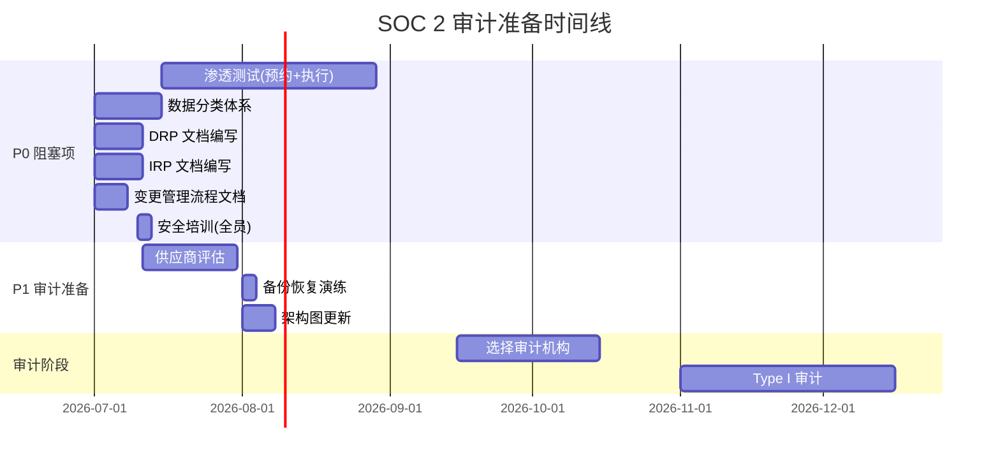

# SOC 2 审计准备清单

> 项目: AI数字名片
> 版本: 1.0 | 创建: 2026-07-01
> 目标: SOC 2 Type I (2026 Q4) → Type II (2027 Q1)
> 参考: `docs/compliance/SOC2_ROADMAP.md` | `docs/security/soc2_readiness.md`

---

## 总体就绪状态

| 信任准则 | 控制总数 | ✅ 已完成 | ⚠️ 部分完成 | ❌ 待完成 | 就绪率 |
|----------|----------|----------|-------------|----------|--------|
| **安全性 (Security)** | 10 | 8 | 1 | 1 | **85%** |
| **可用性 (Availability)** | 8 | 5 | 2 | 1 | **75%** |
| **保密性 (Confidentiality)** | 6 | 4 | 1 | 1 | **75%** |
| **处理完整性 (Processing Integrity)** | 6 | 5 | 1 | 0 | **92%** |
| **合计** | **30** | **22** | **5** | **3** | **82%** |

---

## 1. ✅ 已完成项（文档 + 代码实现）

### 1.1 安全控制 (Security Controls)

| # | 控制项 | 实现位置 | 证据文件 |
|---|--------|---------|---------|
| SC-01 | JWT 双认证 (Access + Refresh Token) | `backend/app/core/auth.py` | `docs/soc2/security-controls.md` §1.3 |
| SC-02 | API Key 认证 (bcrypt 哈希) | `backend/app/middleware/api_key.py` | `docs/soc2/security-controls.md` §1.2 |
| SC-03 | RBAC 角色权限体系 | `backend/app/middleware/rbac.py` | `docs/soc2/security-controls.md` §1.1 |
| SC-04 | HTTPS/TLS 1.2/1.3 传输加密 | Nginx 反向代理配置 | `docs/soc2/security-controls.md` §2.1 |
| SC-05 | 安全 HTTP 响应头 (HSTS/CSP/XFO/RP) | Nginx 安全头配置 | `docs/SECURITY.md` |
| SC-06 | 审计日志中间件 (全量请求记录) | `backend/app/middleware/audit.py` | `docs/soc2/security-controls.md` §3.3 |
| SC-07 | 静态密钥管理 (.env + 环境变量) | `.env.example` / `.env.production` | `docs/SECURITY.md` |
| SC-08 | Docker 网络隔离 | `docker-compose.yml` | `docs/soc2/security-controls.md` §4.2 |
| SC-09 | 漏洞扫描 (Dependabot) | `.github/dependabot.yml` | `docs/SECURITY.md` |
| SC-10 | 静态敏感字段加密 (AES-256) | `backend/app/core/encrypt.py` | `docs/soc2/security-controls.md` §2.2 |

### 1.2 可用性控制 (Availability Controls)

| # | 控制项 | 实现位置 | 证据文件 |
|---|--------|---------|---------|
| AV-01 | `/health` 健康检查端点 | `backend/app/api/health.py` | 运行中端点 |
| AV-02 | Prometheus + Grafana 监控 | `deploy/monitoring/` | `docs/ops/PERFORMANCE_BUDGET.md` |
| AV-03 | SLO 跟踪 (8 条规则) | `backend/app/slo_tracker.py` | `docs/observability/sla-definitions.md` |
| AV-04 | Systemd 自动重启 | `deploy/systemd/*.service` | 部署配置 |
| AV-05 | Docker Compose 多服务编排 | `docker-compose.yml` | 部署配置 |
| AV-06 | Nginx 负载均衡 + 反向代理 | `deploy/nginx/` | `docs/ops/BLUEGREEN_DEPLOY.md` |

### 1.3 保密性控制 (Confidentiality Controls)

| # | 控制项 | 实现位置 | 证据文件 |
|---|--------|---------|---------|
| CO-01 | TLS 1.2/1.3 全站加密 | Nginx SSL 配置 | `docs/security/soc2_readiness.md` §3 |
| CO-02 | AES-256 敏感字段存储加密 | `backend/app/core/encrypt.py` | `docs/soc2/security-controls.md` §2.2 |
| CO-03 | RBAC 用户级数据隔离 | `backend/app/core/rbac.py` | `docs/soc2/security-controls.md` §1.1 |
| CO-04 | JWT 行级权限过滤 | `backend/app/core/security.py` | `docs/SECURITY.md` |

### 1.4 处理完整性控制 (Processing Integrity Controls)

| # | 控制项 | 实现位置 | 证据文件 |
|---|--------|---------|---------|
| PI-01 | Pydantic 输入校验 | `backend/app/schemas/` | 代码层 |
| PI-02 | 支付回调幂等性 | `backend/app/services/payment.py` | 代码层 |
| PI-03 | 数据库事务 + 乐观锁 | `backend/app/models/` | 代码层 |
| PI-04 | 全局异常捕获 + 结构化错误响应 | `backend/app/core/exceptions.py` | 代码层 |
| PI-05 | 业务规则校验层 | `backend/app/services/validators.py` | 代码层 |

---

## 2. ⚠️ 部分完成项

| # | 控制项 | 当前状态 | 缺口 | 计划完成 |
|---|--------|---------|------|---------|
| 1 | 安全代码审查 | PR 阶段人工审查 | 缺少自动化 SAST 集成 | 2026-08 |
| 2 | 数据库高可用 | PostgreSQL 主从待切换 | 配置就绪，未切换 | 2026-07 |
| 3 | 备份恢复 | 定时备份已配置 | 恢复演练未执行 | 2026-08 |
| 4 | 敏感数据脱敏 | 日志脱敏，API 响应未全面覆盖 | 缺少 API 层 Pydantic 脱敏装饰器 | 2026-08 |
| 5 | 定时任务一致性 | 代码就绪 | 缺少 Redis 分布式锁 | 2026-08 |
| 6 | 变更管理流程 | 代码审查已存在 | 缺少正式 CAB 审批流程文档 | 2026-07 |

---

## 3. ❌ 待完成项（外部资源 / 人工流程）

### 3.1 第三方外部审计（需外部供应商）

| # | 待办项 | SOC2_ROADMAP # | 负责人 | 预计成本 | 截止日期 | 状态 |
|---|--------|----------------|--------|---------|---------|------|
| PT-01 | **渗透测试 (第三方)** | P0-1 | 安全团队 | ¥30,000–80,000 | 2026-08 | ❌ 未安排 |
| PT-02 | **选择审计机构** | — | 管理层 | ¥50,000–150,000 | 2026-10 | ❌ 未启动 |

### 3.2 内部文档与流程（需编写/执行）

| # | 待办项 | SOC2_ROADMAP # | 负责人 | 工作量 | 截止日期 | 状态 |
|---|--------|----------------|--------|--------|---------|------|
| DOC-01 | **数据分类标识体系** | P0-2 | 开发团队 | 1 周 | 2026-07 | ❌ 待创建 |
| DOC-02 | **灾难恢复计划 (DRP)** | P0-3 | 运维团队 | 1 周 | 2026-07 | ❌ 待编写 |
| DOC-03 | **事件响应计划 (IRP)** | P0-4 | 安全团队 | 1 周 | 2026-07 | ❌ 待编写 |
| DOC-04 | **变更管理流程文档** | P0-5 | 技术经理 | 3 天 | 2026-07 | ❌ 待编写 |
| DOC-05 | **安全培训（全员）** | P0-6 | HR/安全 | 2 天 | 2026-07 | ❌ 待执行 |
| DOC-06 | **供应商安全评估** | P1-8 | 采购/法务 | 2 周 | 2026-08 | ❌ 待创建 |
| DOC-07 | **备份恢复测试记录** | P1-11 | 运维团队 | 1 天 | 2026-08 | ❌ 待执行 |
| DOC-08 | **安全策略文档** | P2-16 | 安全团队 | 1 周 | 2026-09 | ❌ 待编写 |
| DOC-09 | **员工入职/离职 SOP** | P2-17 | HR | 3 天 | 2026-09 | ❌ 待编写 |
| DOC-10 | **数据留存策略** | P2-18 | 法务/运维 | 3 天 | 2026-09 | ❌ 待编写 |
| DOC-11 | **架构与数据流图更新** | P1-14 | 架构师 | 3 天 | 2026-08 | ❌ 待更新 |

### 3.3 P0 阻塞项详细状态

根据 `docs/compliance/SOC2_ROADMAP.md` 第2节，**6 项 P0 阻塞项** 分析如下:

| # | P0 项 | 代码实现 | 文档就绪 | 外部依赖 | 总体状态 |
|---|-------|---------|---------|---------|---------|
| 1 | 渗透测试 (第三方) | ❌ 无代码项 | ⚠️ 模板已创建 (`docs/soc2/penetration-test-template.md`) | ❌ 需预约第三方安全公司 | **未启动** |
| 2 | 数据分类标识体系 | ❌ 尚未实现 | ❌ 尚未编写 | ⚠️ 内部任务 | **未启动** |
| 3 | 灾难恢复计划 (DRP) | ⚠️ 备份脚本已就绪 (`scripts/backup.sh`) | ❌ DRP 文档缺失 | ⚠️ 内部任务 | **部分 — 脚本就绪，文档待编** |
| 4 | 事件响应计划 (IRP) | ⚠️ 事件分类已在 `docs/soc2/security-controls.md` §5.1 | ❌ 正式 IRP 文档缺失 | ⚠️ 内部任务 | **部分 — 分类就绪，流程文档待编** |
| 5 | 变更管理流程文档 | ⚠️ GitHub PR 流程已存在 | ❌ 正式 CAB 流程文档缺失 | ⚠️ 内部任务 | **部分 — 代码审查就绪，CAB 文档待编** |
| 6 | 安全培训（全员） | ❌ 无代码项 | ❌ 培训材料未准备 | ⚠️ 内部任务 | **未启动** |

**结论: 0/6 P0 项完全完成。** 所有 P0 项均尚处于未启动或部分就绪状态。
Type I 审计启动前必须完成全部 6 项。

---

## 4. 外部依赖汇总

### 4.1 需第三方供应商

| 依赖项 | 供应商类型 | 建议厂商 | 预计周期 | 前置依赖 |
|--------|-----------|---------|---------|---------|
| 渗透测试 | 安全服务商 | 奇安信/绿盟/长亭 | 2 周执行 + 1 周报告 | 无 |
| SOC 2 审计机构 | 认证机构 | A-LIGN/Schellman/Bishop Fox | 6–8 周 | 全部 P0 完成 |

### 4.2 需内部资源

| 依赖项 | 所需角色 | 预估人天 | 可并行 |
|--------|---------|---------|--------|
| 数据分类体系 | 开发团队 | 5 人天 | ✅ 与渗透测试并行 |
| DRP 文档 | 运维团队 | 5 人天 | ✅ |
| IRP 文档 | 安全团队 | 5 人天 | ✅ |
| 变更流程文档 | 技术经理 | 3 人天 | ✅ |
| 安全培训 | HR + 安全 | 2 人天 | ✅ |
| 供应商评估 | 采购/法务 | 10 人天 | 需渗透测试后 |

---

## 5. 关键里程碑时间线

---

## 6. 快速行动清单（本周）

- [ ] **优先预约渗透测试** — 这是最长路径（厂商排期 2-4 周）
- [ ] 启动数据分类体系设计（公开/内部/机密/限制四层）
- [ ] 编写 DRP 文档（可参考 `docs/compliance/DRP.md` 现有内容）
- [ ] 编写 IRP 文档（可基于 `docs/soc2/security-controls.md` §5 扩展）
- [ ] 编写变更管理流程文档
- [ ] 安排首次安全培训日期

> **就绪阈值**: 所有 P0 项完成 (6/6) + 运营数据积累 ≥ 3 个月 → 可启动 Type I 审计。
> 当前 P0 完成: **0/6** | 总体就绪率: **~82%**
