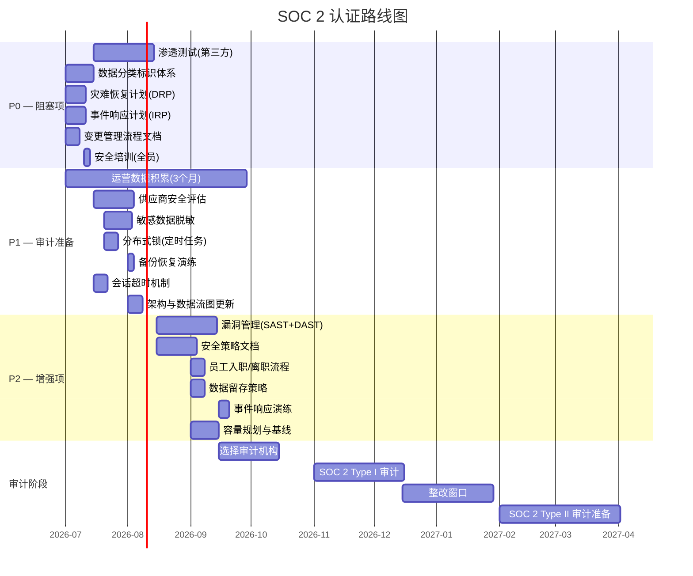

# SOC 2 认证路线图

> 项目: AI数字名片
> 版本: 1.0 | 更新: 2026-07-01
> 目标: 2026 Q4 Type I → 2027 Q1 Type II

---

## 1. 当前就绪状态

| 信任准则 | 就绪率 | 控制项总数 | 已实现 | 部分实现 | 缺失 |
|----------|--------|------------|--------|----------|------|
| 安全性 | ~85% | 10 | 8 | 1 | 1 |
| 可用性 | ~75% | 8 | 5 | 2 | 1 |
| 保密性 | ~75% | 6 | 4 | 1 | 1 |
| 处理完整性 | ~92% | 6 | 5 | 1 | 0 |
| **合计** | **~82%** | **30** | **22** | **5** | **3** |

---

## 2. P0 — 阻塞项 (必须立即完成)

未完成则无法启动 Type I 审计。

| # | 待办项 | 负责人 | 预计工作量 | 完成期限 | 说明 |
|---|--------|--------|-----------|---------|------|
| 1 | **渗透测试 (第三方)** | 安全团队 | 2 周 | 2026-08 | 预约第三方安全公司执行，出具正式报告 |
| 2 | **数据分类标识体系** | 开发团队 | 1 周 | 2026-07 | 建立 公开/内部/机密/限制 四层分类；所有 API 响应和 DB 字段标注分类 |
| 3 | **灾难恢复计划 (DRP)** | 运维团队 | 1 周 | 2026-07 | 含 RTO ≤ 4h, RPO ≤ 1h；每年演练 ≥ 1 次 |
| 4 | **事件响应计划 (IRP)** | 安全团队 | 1 周 | 2026-07 | 定义 Tier 1~3 事件分类、响应流程、上报路径 |
| 5 | **变更管理流程文档** | 技术经理 | 3 天 | 2026-07 | 正式 CAB 审批流程，含紧急变更、回滚预案 |
| 6 | **安全培训（全员）** | HR / 安全 | 2 天 | 2026-07 | 年度安全培训 + 考核记录 |

---

## 3. P1 — 高优先项 (审计准备)

| # | 待办项 | 负责人 | 预计工作量 | 完成期限 | 说明 |
|---|--------|--------|-----------|---------|------|
| 7 | **运营数据积累 (3个月)** | 运维团队 | 持续 | 2026-09 | 持续采集控制有效性证据（日志、指标、审计追踪） |
| 8 | **供应商安全评估** | 采购/法务 | 2 周 | 2026-08 | 评估所有第三方 SaaS 依赖（AWS、Redis、Sentry 等） |
| 9 | **敏感数据脱敏 — API 响应层** | 开发团队 | 1 周 | 2026-08 | 完善 Pydantic schema 层脱敏装饰器 |
| 10 | **分布式锁 — 定时任务** | 开发团队 | 3 天 | 2026-08 | 为 Celery / APScheduler 引入 Redis 分布式锁 |
| 11 | **备份恢复演练** | 运维团队 | 1 天 | 2026-08 | 执行数据库恢复测试并记录结果 |
| 12 | **会话超时 + 空闲断开** | 开发团队 | 3 天 | 2026-08 | JWT access_token 15min + refresh_token 7d |
| 13 | **正式变更审批记录** | 技术经理 | 持续 | 2026-08 | 建立审批台账或 Jira 工作流 |
| 14 | **系统架构与数据流图更新** | 架构师 | 3 天 | 2026-08 | 更新现有架构图，标注数据分类边界 |

---

## 4. P2 — 增强项 (Type II 准备)

| # | 待办项 | 负责人 | 预计工作量 | 完成期限 | 说明 |
|---|--------|--------|-----------|---------|------|
| 15 | **漏洞管理生命周期** | 安全团队 | 1 周 | 2026-09 | SAST (Semgrep) + DAST (ZAP) + 漏洞修复 SLA |
| 16 | **安全策略文档编写** | 安全团队 | 1 周 | 2026-09 | 信息安全策略、可接受使用策略、密码策略 |
| 17 | **员工入职/离职检查流程** | HR | 3 天 | 2026-09 | 账号创建/回收标准操作流程 |
| 18 | **数据留存策略文档** | 法务/运维 | 3 天 | 2026-09 | 定义各类数据保留期限和销毁策略 |
| 19 | **事件响应桌面演练** | 安全团队 | 1 天 | 2026-09 | 模拟安全事件并记录演练改进项 |
| 20 | **容量规划与性能基线** | 运维团队 | 1 周 | 2026-09 | 建立性能基准和扩容触发阈值 |
| 21 | **SQL 注入 / XSS 专项测试** | 开发/QA | 1 周 | 2026-09 | 结合 ZAP 扫描 + 人工代码审查 |
| 22 | **物理与环境安全策略** | 运维团队 | 3 天 | 2026-10 | 云基础设施安全基线文档 |

---

## 5. 时间线 (甘特图)

---

## 6. 证据清单

| 证据项 | 关联待办 | 状态 | 负责人 |
|--------|---------|------|--------|
| 渗透测试报告 | P0-1 | ❌ 待安排 | 安全团队 |
| 数据分类清单 | P0-2 | ❌ 待创建 | 开发团队 |
| DRP 文档 | P0-3 | ❌ 待编写 | 运维团队 |
| IRP 文档 | P0-4 | ❌ 待编写 | 安全团队 |
| 变更流程文档 | P0-5 | ❌ 待编写 | 技术经理 |
| 培训记录表 | P0-6 | ❌ 待执行 | HR |
| 供应商评估报告 | P1-8 | ❌ 待创建 | 采购/法务 |
| 备份恢复测试记录 | P1-11 | ❌ 待执行 | 运维团队 |
| 安全策略文档 | P2-16 | ❌ 待编写 | 安全团队 |
| 员工入职/离职 SOP | P2-17 | ❌ 待编写 | HR |
| 数据留存策略 | P2-18 | ❌ 待编写 | 法务 |
| 演练报告 | P2-19 | ❌ 待执行 | 安全团队 |
| 容量规划报告 | P2-20 | ❌ 待创建 | 运维团队 |

---

## 7. 风险与缓解

| 风险 | 概率 | 影响 | 缓解措施 |
|------|------|------|---------|
| 渗透测试排期延迟 | 中 | 高 | 提前 2 个月预约，准备备用供应商 |
| 运营数据不足 3 个月 | 低 | 高 | 立即开始采集，审计前确认最低数据量 |
| Type II 要求 6 个月数据 | 中 | 中 | 2027-02 前积累约 7 个月，满足要求 |
| 预算不足 | 低 | 中 | 优先 P0，P2 可延后至 Type II 阶段 |

---

## 8. 参考文档

- [`docs/security/soc2_readiness.md`](../security/soc2_readiness.md) — SOC 2 就绪检查清单
- [`docs/soc2/README.md`](../soc2/README.md) — SOC 2 合规概述
- [`docs/soc2/security-controls.md`](../soc2/security-controls.md) — 安全控制项详情
- [`docs/soc2/penetration-test-template.md`](../soc2/penetration-test-template.md) — 渗透测试报告模板
- [`docs/SECURITY.md`](../SECURITY.md) — 安全策略总览
- [`docs/SLA.md`](../SLA.md) — 服务级别协议

---

> **建议**: 每周五更新此路线图状态。P0 全部完成后即可启动 Type I 审计机构选择流程。
