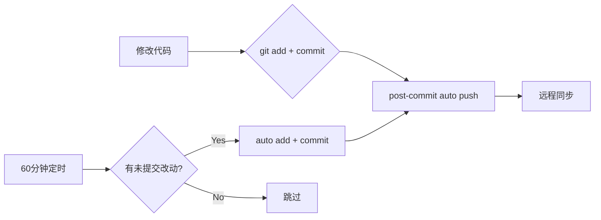

# AI数智名片 — 工业化 Git 工作流

## 概述

本项目采用 **自动化 + 可控** 的 Git 工作流，降低日常开发的心智负担，同时确保关键分支（master）的 push 操作保持手动控制。

---

## 1. 自动推送 (post-commit hook)

**位置**: `.git/hooks/post-commit`

**工作机制**：每次执行 `git commit` 后，git 自动运行该 hook，判断当前分支后决定是否 push。

### 自动推送的分支

| 分支模式 | 行为 |
|---------|------|
| `develop` | ✅ 自动 push |
| `feature/*` | ✅ 自动 push |
| `fix/*` | ✅ 自动 push |
| `master` / `main` | ❌ 不推送（必须手动） |
| 其他分支 | ❌ 不推送 |

### 为什么不自动推送 master

- master 是生产/发布分支，push 操作应当有意识地进行
- 防止未经 review 的代码直接推送到 master
- 建议流程：feature → develop → (PR) → master

### 测试方法

```bash
# 1. 在 develop 分支做空提交测试
git commit --allow-empty -m "test hook"

# 2. 观察输出，应看到类似：
#   [post-commit] Auto-pushing branch: develop
#   To github.com:eagle13579/ai-digital-card.git
#   1234567..abcdef  develop -> develop

# 3. 回退测试提交
git revert HEAD --no-edit
# 注意：revert 会触发 post-commit hook 再次推送 revert commit
```

---

## 2. 定时自动保存 (cron)

**脚本位置**: `scripts/git-auto-save.py`
**cron 注册名**: `ai-digital-card-git-auto-save`
**执行频率**: 每 60 分钟
**执行方式**: no-agent（直接执行脚本，不经过 LLM）

### 工作流程

```
每隔 60 分钟 ─→ git-auto-save.py
                    │
                    ├─ 检查工作区是否有未提交改动？
                    │   ├─ 无 → 跳过（输出 "工作区干净"）
                    │   └─ 有 ─→ 检查分支名？
                    │               ├─ develop/feature/*/fix/* → 继续
                    │               └─ 其他分支 → 跳过
                    │
                    ├─ git add -A
                    ├─ git commit -m "auto-save: 改动简述"
                    └─ [post-commit hook 自动触发 push]
```

### 脚本特性

- **分支安全检查**: 仅在 `develop`、`feature/*`、`fix/*` 分支自动保存
- **智能提交信息**: 自动生成 `auto-save: +N file(s), ~M file(s), -K file(s)` 格式的提交信息
- **幂等**: 工作区干净时不做任何操作
- **安全测试**: 支持 `--dry-run` 参数，预览但不执行
- **.gitignore 保障**: 敏感文件（`.env`、`__pycache__/`、`node_modules/` 等）不会被提交

### 手动执行

```bash
# 正常模式
python scripts/git-auto-save.py

# 预览模式（不实际 add/commit）
python scripts/git-auto-save.py --dry-run
```

### 分支安全策略

只有以下分支允许自动提交和推送：

| 分支 | 允许自动？ | 理由 |
|------|-----------|------|
| `develop` | ✅ | 日常开发主干 |
| `feature/*` | ✅ | 功能分支，适合频繁保存 |
| `fix/*` | ✅ | 修复分支，适合频繁保存 |
| `master` | ❌ | 生产分支，必须手动 |
| `release/*` | ❌ | 发布准备，手动控制 |
| 其他 | ❌ | 防止意外提交 |

---

## 3. 安全规则

1. **不硬编码密钥**: hook 和脚本中不包含任何密钥、密码、token
2. **分支隔离**: master/main 永不自动推送
3. **.gitignore 清单**（已配置）:
   - `__pycache__/`, `*.py[cod]` — Python 缓存
   - `.env*` — 环境变量
   - `node_modules/` — Node 依赖
   - `*.pem`, `*.key` — 证书
   - `*.db*` — 数据库文件
   - `.vscode/`, `.idea/` — IDE 配置

4. **pre-commit 钩子**: 本仓库已有 pre-commit hook，自动检测提交中是否包含密钥（`sk-*`、`api_key`、`secret`、`token`、`password` 等模式），发现则阻止提交

---

## 4. 日常开发流程



### 标准操作

```bash
# 日常开发
git checkout develop
# 修改文件...
git add -A
git commit -m "feat: xxx"
# → 自动 push 到 origin/develop

# 功能分支
git checkout -b feature/my-feature
# 修改文件...
git commit -m "feat: xxx"
# → 自动 push 到 origin/feature/my-feature

# 修复分支
git checkout -b fix/bug-xxx
# 修改文件...
git commit -m "fix: xxx"
# → 自动 push 到 origin/fix/bug-xxx

# 发布时：手动操作
git checkout master
git merge develop
git push origin master  # 手动！
git tag v3.1.0
git push origin v3.1.0  # 手动！
```

### 查看 cron 状态

```bash
hermes cron list
hermes cron run ai-digital-card-git-auto-save  # 立即执行一次
```

---

## 5. 故障排除

### post-commit 不生效

```bash
# 检查 hook 是否有执行权限
ls -la .git/hooks/post-commit
# 应显示 -rwxr-xr-x 或类似

# 手动执行测试
bash .git/hooks/post-commit
```

### 自动保存脚本报错

```bash
# 用 dry-run 排查
python scripts/git-auto-save.py --dry-run

# 检查 Python 版本
python --version  # 需要 >= 3.8
```

### 撤销自动保存提交

```bash
# 如果 auto-save commit 需要撤销
git log --oneline  # 找到 auto-save commit
git revert <commit-hash>
# revert 会触发 post-commit 再次 push，注意观察
```
