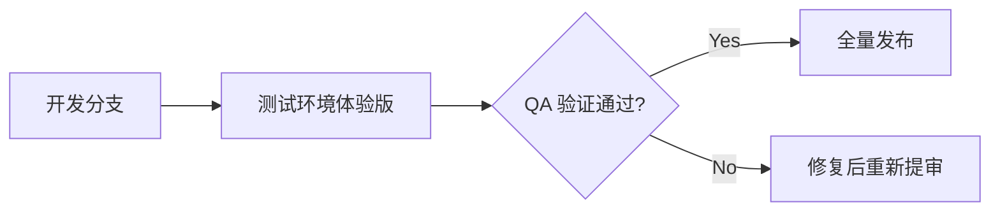

# AI数智名片 — 小程序最佳实践

> 最后更新: 2026-07-15

---

## 1. 代码规范

### 1.1 命名风格
- **变量/函数**: camelCase (`loadPageData`, `getUserProfile`)
- **常量**: UPPER_SNAKE_CASE (`USE_MOCK`, `COVER_MAX_SIZE`)
- **文件/目录**: kebab-case (`mock-service.js`, `test-data.js`)
- **Page data 属性**: camelCase, 禁止下划线前缀（`_t` 为 i18n 保留字段除外）

### 1.2 模块引用
```javascript
// ✅ 正确
const { MockService } = require('../../utils/mockService')
const { Logger } = require('../../utils/util')

// ❌ 禁止: 相对路径过长
const { api } = require('../../../utils/some/deep/path')
```

### 1.3 异步处理
```javascript
// ✅ 使用 async/await
async loadPageData() { ... }

// ✅ 调用处统一 _fetchWithRetry + .catch()
const data = await this._fetchWithRetry(fn, fallback)

// ❌ 禁止: 裸 Promise 无 .catch()
MockService.getProfile()  // 必须链式 .catch()
```

### 1.4 日志
```javascript
// 统一使用 Logger 模块
Logger.info('首页', '数据加载完成', { key: value })
Logger.warn('首页', '降级使用缓存', err)
Logger.error('首页', '加载失败', err)

// ❌ 禁止: 直接 console.log / console.error（测试文件除外）
```

---

## 2. 数据安全

### 2.1 用户数据保护
- **绝不**在日志中输出完整 token、密码、手机号
- 用户信息展示前做脱敏：`phone.replace(/(\d{3})\d{4}(\d{4})/, '$1****$2')`
- 本地 store 不持久化敏感字段（仅存 token、userInfo.name/avatar）

### 2.2 API 调用规范
- 所有 API 调用必须经过 `_fetchWithRetry` 或等价重试包装
- 生产环境禁用在 URL 中拼接明文参数（使用 `data` body 或加密 query）
- 不使用 `eval` / `new Function` 解析 API 返回

### 2.3 配置安全
- 微信 AppSecret、API Key 等敏感配置**仅在服务端环境变量**中存储
- 小程序端仅暴露 `appid` 用于 wx.login

---

## 3. 发布流程

### 3.1 发布前检查清单
- [ ] `mockService.js` 中 `USE_MOCK = false`
- [ ] 所有 `.catch()` 兜底数据已配置
- [ ] 微信开发者工具 → 详情 → 本地设置 → "增强编译" 关闭（生产环境）
- [ ] `app.json` 中 `networkTimeout` 已配置（建议 `request: 10000`）
- [ ] 云开发/后端 API 域名已添加到 "request 合法域名"
- [ ] 体验版验证：核心流程走通（首页加载 → 名片创建 → 匹配推荐）

### 3.2 灰度发布


### 3.3 版本号规范
- 版本号格式: `major.minor.patch` (如 `1.3.0`)
- major: 大功能重构或 UI 重设计
- minor: 新功能/新页面
- patch: Bug 修复/性能优化

---

## 4. 测试清单

### 4.1 首页加载测试
```
□ Mock 模式: 数据正常展示，布局完整
□ 真实API模式:
  □ getUserProfile 超时 → 降级显示默认用户信息
  □ getBrochures 返回空 → 显示"创建名片"引导
  □ getTrustNetwork 500 → 信任网络区域隐藏
  □ getRecommendList 断开网络 → 推荐列表显示为空
□ 4个API全部超时 → 页面不白屏，loading 状态正常结束
□ 访客统计接口失败 → stats.visitors = 0，不报错
□ 所有降级场景均有日志输出
```

### 4.2 重试机制验证
```
□ 接口第1次失败（超时/500）→ 自动重试第2次
□ 第2次成功 → 正常渲染
□ 第2次也失败 → 使用 fallback 数据
□ 重试间隔指数退避: 500ms → 1000ms
□ 总超时 8秒/次，2次重试 = 最多 16秒 + 退避
```

### 4.3 性能测试
```
□ 首页 TTI（可交互时间）< 3s（模拟 4G 网络）
□ setData 单次 < 1024KB
□ 列表渲染无卡顿（推荐列表 ≤ 3 条，信任列表 ≤ 10 条）
```

---

## 5. 常见陷阱

### 5.1 Promise.all 全部失败
```javascript
// ❌ 问题: 一个 Promise 无 .catch() → 整个 Promise.all 抛出
[profileRes, brochuresRes] = await Promise.all([
  api.getProfile(),          // 失败时无兜底
  api.getBrochures().catch(() => ({ data: [] })),
])

// ✅ 正确: 每个 Promise 独立兜底
[profileRes, brochuresRes] = await Promise.all([
  api.getProfile().catch(() => fallbackProfile),
  api.getBrochures().catch(() => ({ data: [] })),
])
```

### 5.2 全局异常吞没
```javascript
// ❌ 问题: 空 .catch() 导致错误完全不可见
api.getStats().catch(() => {})

// ✅ 正确: 至少打印 warning
api.getStats().catch(err => Logger.warn('Stats', '获取失败', err))
```

### 5.3 硬编码 URL
```javascript
// ❌ 禁止: 硬编码 CDN 域名
return `https://card.liankebao.top/uploads/covers/${name}`

// ✅ 正确: 从 settings/API 基地址构建
// 后端: settings.BASE_URL.rstrip('/') + '/uploads/covers/' + name
```

### 5.4 USE_MOCK 忘记关闭
```javascript
// mockService.js — 发布前务必设为 false
const MockService = {
  USE_MOCK: false,  // ← 发布生产环境前确认
  ...
}
```

### 5.5 `this` 上下文丢失
```javascript
// ❌ 问题: 回调函数中 this 指向改变
setTimeout(function() {
  this.setData({ ... })  // this 不是 Page
}, 1000)

// ✅ 正确: 使用箭头函数
setTimeout(() => {
  this.setData({ ... })
}, 1000)
```

---

## 6. 九步法引擎流程

小程序数据加载完整链路：

```
Step 1 — Page.onLoad()
  ├─ Logger.info('页面', '加载')
  ├─ store.getState() 取本地缓存
  └─ 调用 loadPageData()

Step 2 — loadPageData()
  ├─ setData({ loading: true })  显示骨架屏
  └─ 进入 try 块

Step 3 — 并发请求（Promise.all）
  ├─ getUserProfile()     → 用户资料 + 会员等级
  ├─ getBrochures()       → 名片列表
  ├─ getTrustNetwork()    → 信任网络（点赞/关注）
  └─ getRecommendList()   → AI 匹配推荐

Step 4 — _fetchWithRetry 包装
  每路请求:
    Attempt 1: 发请求 + 8s 超时
    ├─ 成功 → 返回结果
    └─ 失败 → Attempt 2 (1000ms 退避)
      ├─ 成功 → 返回结果 + 日志
      └─ 失败 → 返回 fallback 数据 + 日志

Step 5 — 数据清洗
  ├─ profileRes.data ?? profileRes
  ├─ brochuresRes.data ?? brochuresRes
  ├─ trustNetRes.data ?? trustNetRes
  └─ recommendRes.data ?? recommendRes

Step 6 — 数据装配
  ├─ userInfo = { name, avatar, company, title }
  ├─ brochure = brochuresList[0] || null
  ├─ stats = { visitors, matches, trust }
  └─ trustList = trustData.trusting.slice(0, 10)

Step 7 — 访客统计（可选，fire-and-forget）
  ├─ 只有 brochure 存在时执行
  ├─ _fetchWithRetry(getVisitorStats)
  └─ 成功后更新 stats.visitors

Step 8 — setData 渲染
  ├─ userInfo, memberLevel, stats, brochure
  ├─ trustList, recommendList
  ├─ showEmpty, showUpgradeHint
  └─ loading: false

Step 9 — 善后
  ├─ Logger.info('首页', '加载完成')
  └─ _checkOnboarding() 新手引导
```

### 降级策略总结

| 接口               | 失败时行为                     | fallback 数据                     |
|--------------------|-------------------------------|-----------------------------------|
| getUserProfile     | 显示默认用户信息              | `{ userInfo: {}, memberLevel: 'free' }` |
| getBrochures       | 显示"创建名片"引导            | `[]`                              |
| getTrustNetwork    | 信任网络区域隐藏              | `{ trusting: [], trusted_by: [] }` |
| getRecommendList   | 推荐列表显示为空              | `[]`                              |
| getVisitorStats    | stats.visitors = 0            | `{ total_visits: 0, total: 0 }`   |
| 全部失败            | 页面正常渲染，无内容区块      | —                                 |

---

## 附录: 环境切换

```bash
# 开发模式（mockService.js）
USE_MOCK = true
# 模拟数据 + 随机延迟 100-300ms

# 生产模式（mockService.js）
USE_MOCK = false
# 走真实 API，_fetchWithRetry 提供超时 + 2次重试 + 降级
```
