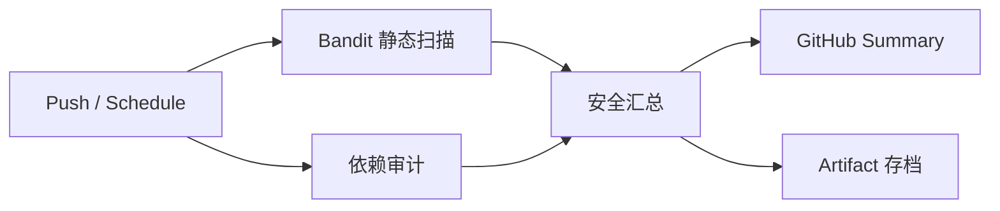
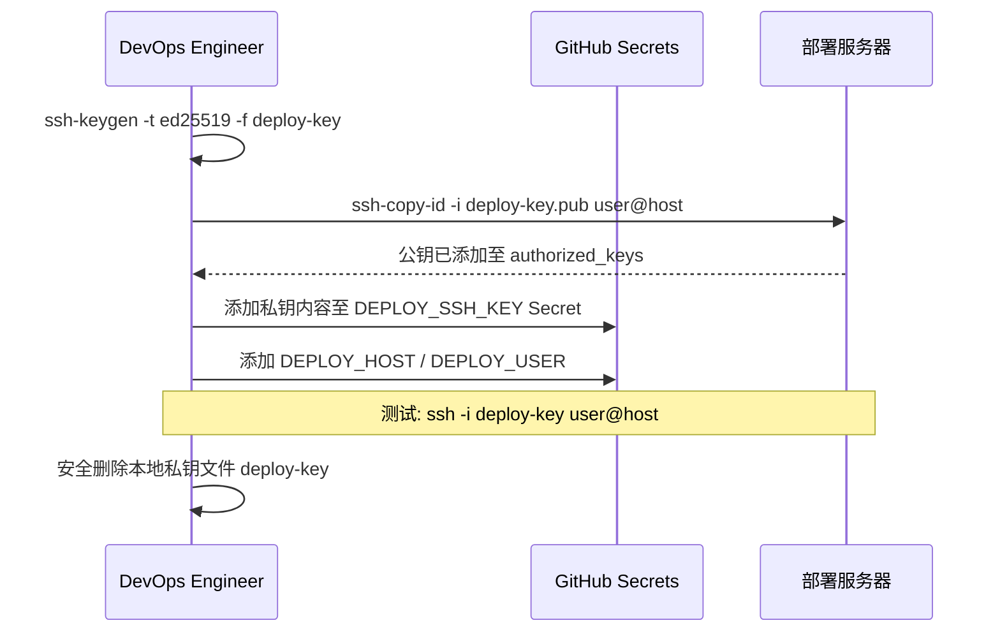

# CI 安全指南

> **项目**: AI 数智名片 (AI Digital Business Card)
> **版本**: v1.0
> **生效日期**: 2026-07-01
> **维护**: DevOps / Security Team

---

## 目录

1. [概述](#1-概述)
2. [CI 安全扫描流水线](#2-ci-安全扫描流水线)
3. [SSH 密钥认证规范](#3-ssh-密钥认证规范)
4. [Secret 管理](#4-secret-管理)
5. [依赖漏洞处理流程](#5-依赖漏洞处理流程)
6. [安全扫描结果解读](#6-安全扫描结果解读)
7. [常见问题 FAQ](#7-常见问题-faq)

---

## 1. 概述

本文档定义 AI 数智名片项目的 CI/CD 安全规范，涵盖：

- **静态安全扫描**: Bandit (Python 代码安全分析)
- **依赖审计**: pip-audit + Safety (Python 依赖漏洞扫描)
- **部署安全**: SSH 密钥认证替代 sshpass
- **Secret 管理**: GitHub Secrets 最佳实践

### 1.1 安全原则

| 原则 | 说明 |
|------|------|
| **最小权限** | CI Token 仅授予必要权限 |
| **密钥优先** | 禁止密码认证，一律使用 SSH Key |
| **默认不阻塞** | 安全扫描仅报告，不阻塞 CI 构建 |
| **可见性** | 所有安全结果汇总到 GitHub Actions Summary |

---

## 2. CI 安全扫描流水线

### 2.1 工作流文件

`.github/workflows/security-scan.yml`

### 2.2 触发条件

| 事件 | 触发时机 |
|------|----------|
| `push` | 推送到 `main` 分支 |
| `schedule` | 每周一 UTC 08:00 (北京时间 16:00) |
| `workflow_dispatch` | 手动触发 |

### 2.3 Job 架构



### 2.4 各 Job 说明

#### Job 1: Bandit — 静态安全分析

| 项目 | 说明 |
|------|------|
| 工具 | [Bandit](https://github.com/PyCQA/bandit) v1.9+ |
| 扫描范围 | `backend/` 目录 |
| 严重级别 | `-ll` (仅 HIGH + MEDIUM) |
| 报告格式 | 自定义文本格式，含文件路径 + 行号 |
| 存档 | `bandit-report.txt` (保留 30 天) |

**Bandit 检测类型**:

- SQL 注入 (`sql_statements`)
- 命令注入 (`subprocess_without_shell_equals_true`)
- 硬编码密码 (`hardcoded_password`)
- 不安全的 `yaml.load` (`yaml_load`)
- 不安全的 `pickle` 反序列化 (`pickle`)
- Flask/FastAPI 调试模式开启
- `assert` 在生产代码中使用
- 不安全的 JWT 配置
- 请求伪造 (SSRF)

#### Job 2: Dependency Audit — 依赖审计

| 项目 | 说明 |
|------|------|
| 工具 1 | [pip-audit](https://github.com/pypa/pip-audit) — Python 依赖漏洞扫描 |
| 工具 2 | [Safety](https://github.com/pyupio/safety) — 已知漏洞数据库匹配 |
| 扫描范围 | `backend/requirements.txt` |
| 存档 | `pip-audit-report.txt`, `safety-report.txt` (保留 30 天) |

#### Job 3: Security Summary — 结果汇总

- 下载所有 job 的报告
- 生成 Markdown 格式的 CI Summary
- 在 GitHub Actions 页面直接展示

### 2.5 continue-on-error 策略

所有安全扫描 Job 设置 `continue-on-error: true`，**不会阻塞 CI 构建**。

原因：

1. **历史基线**: 首次接入时可能存在大量历史问题，阻塞 CI 会影响开发效率
2. **信息优先**: 安全扫描的目的是提供信息，而非阻断
3. **逐步收紧**: 待基线稳定后，可逐步提升为 warning → blocking

---

## 3. SSH 密钥认证规范

### 3.1 背景

早期部署脚本使用 `sshpass` 进行密码认证，存在以下风险：

| 风险 | 说明 |
|------|------|
| 密码泄露 | GitHub Actions 日志可能泄露密码 |
| 暴力破解 | 密码认证易受暴力破解攻击 |
| 审计困难 | 无法追踪谁使用了密码登录 |
| 轮换繁琐 | 密码变更需要更新所有使用方 |

### 3.2 规范要求

| # | 要求 | 强制 |
|---|------|:----:|
| 1 | 所有 SSH 操作使用密钥对认证 | ✅ |
| 2 | 禁止在 CI 中使用 `sshpass`、`expect` 或密码明文 | ✅ |
| 3 | 私钥使用 `ed25519` 算法生成 | 推荐 |
| 4 | 私钥存储为 GitHub Secret (`DEPLOY_SSH_KEY`) | ✅ |
| 5 | 公钥部署到服务器的 `~/.ssh/authorized_keys` | ✅ |
| 6 | 每 180 天轮换密钥对 | 推荐 |

### 3.3 密钥生成

```bash
# 生成 ed25519 密钥对 (推荐)
ssh-keygen -t ed25519 -f deploy-key -C "ci-deploy@ai-digital-card"

# 或 RSA (兼容性更好)
ssh-keygen -t rsa -b 4096 -f deploy-key -C "ci-deploy@ai-digital-card"
```

### 3.4 密钥配置流程



### 3.5 在 Workflow 中使用

**方式一**: `appleboy/ssh-action` (推荐，用于远程命令执行)

```yaml
- name: Deploy via SSH
  uses: appleboy/ssh-action@v1.2.0
  with:
    host: ${{ secrets.DEPLOY_HOST }}
    username: ${{ secrets.DEPLOY_USER }}
    key: ${{ secrets.DEPLOY_SSH_KEY }}
    script: |
      cd /opt/ai-digital-card
      docker compose pull
      docker compose up -d
```

**方式二**: `webfactory/ssh-agent` (用于多步 SSH 操作)

```yaml
- name: Setup SSH
  uses: webfactory/ssh-agent@v0.9.0
  with:
    ssh-private-key: ${{ secrets.DEPLOY_SSH_KEY }}

- name: Run remote command
  run: ssh -o StrictHostKeyChecking=no user@host "command"
```

---

## 4. Secret 管理

### 4.1 项目中使用的 GitHub Secrets

| Secret 名称 | 用途 | 敏感等级 | 所属 Workflow |
|-------------|------|:--------:|---------------|
| `DEPLOY_SSH_KEY` | SSH 认证私钥 | 🔴 严重 | deploy.yml, canary-ci.yml |
| `DEPLOY_HOST` | 部署服务器主机名 | 🟡 中 | deploy.yml, canary-ci.yml |
| `DEPLOY_USER` | 部署服务器 SSH 用户 | 🟢 低 | deploy.yml, canary-ci.yml |
| `KUBE_CONFIG` | Kubernetes 集群配置 (Base64) | 🔴 严重 | canary.yml |
| `PREVIOUS_STABLE_IMAGE` | 回滚用镜像引用 | 🟢 低 | canary.yml |

### 4.2 GitHub Actions Secret 设置

```bash
# 在 GitHub Repo → Settings → Secrets and variables → Actions 中设置

# 推荐: 使用 GitHub CLI 设置
gh secret set DEPLOY_SSH_KEY < deploy-key-private
gh secret set DEPLOY_HOST --body "192.168.1.100"
gh secret set DEPLOY_USER --body "deploy"
```

### 4.3 Secret 安全要求

| 要求 | 说明 |
|------|------|
| 禁止硬编码 | 禁止在代码/配置文件中写入任何 Secret 值 |
| 日志脱敏 | GitHub Actions 自动脱敏 Secret 输出，但仍需注意 |
| 最小权限 | 每个 Secret 只用于其设计用途 |
| 定期轮换 | 参考 [密钥轮换策略](#35-密钥轮换流程) |

### 4.4 密钥轮换流程

```bash
# 1. 生成新密钥对
ssh-keygen -t ed25519 -f deploy-key-new -C "ci-deploy-$(date +%Y%m)"

# 2. 添加新公钥到服务器 (保持旧公钥仍可用)
ssh-copy-id -i deploy-key-new.pub user@host

# 3. 更新 GitHub Secret
gh secret set DEPLOY_SSH_KEY < deploy-key-new

# 4. 触发一次部署验证新密钥
# 5. 从 authorized_keys 中移除旧公钥
ssh user@host "sed -i '/ci-deploy-/d' ~/.ssh/authorized_keys"

# 6. 安全删除旧密钥文件
shred -u deploy-key-new deploy-key-new.pub
```

---

## 5. 依赖漏洞处理流程

### 5.1 CVSS 分级响应

| 严重等级 | CVSS 分数 | 响应时限 | 处理方式 |
|:--------:|:---------:|:--------:|----------|
| 🔴 严重 | >= 9.0 | 24 小时 | 紧急修复 + 热修复发布 |
| 🟠 高 | 7.0 - 8.9 | 7 天 | 在下个发布中包含 |
| 🟡 中 | 4.0 - 6.9 | 30 天 | 列入迭代计划 |
| 🟢 低 | < 4.0 | 下个大版本 | 记录追踪 |

### 5.2 修复步骤

1. **确认漏洞影响**: 检查 CVE 详情，确认是否影响当前使用方式
2. **升级依赖**: `pip install --upgrade <package>` 或更新 `requirements.txt`
3. **运行测试**: `pytest -v` 确认无回归
4. **提交 PR**: 引用 CVE 编号，说明修复内容
5. **等待 Security Scan 通过**: CI 通过后合并

### 5.3 无法立即升级时的缓解措施

| 措施 | 说明 |
|------|------|
| WAF 规则 | 在 Nginx/CDN 层添加防护规则 |
| 功能降级 | 临时禁用受影响的功能 |
| 网络隔离 | 限制受影响服务的网络访问 |
| 监控增强 | 添加额外的入侵检测规则 |

---

## 6. 安全扫描结果解读

### 6.1 Bandit 输出示例

```
>> Issue: [B108:hardcoded_password] Possible hardcoded password
   Severity: HIGH   Confidence: MEDIUM
   Location: backend/app/config.py:42
      42    DB_PASSWORD = "supersecret"
```

**处理**: 将硬编码密码移至环境变量或 Secret Manager。

### 6.2 pip-audit 输出示例

```
Found 2 known vulnerabilities in 1 package
Name    Version ID                  Fix Versions
urllib3 1.26.5  PYSEC-2023-123      1.26.18
                CVE-2023-43804      1.26.19
```

**处理**: 升级 urllib3 到 >= 1.26.19。

### 6.3 Safety 输出示例

```
+============+========================+==========================+==========+
|  Package   |      CVE/Vuln ID       |       Advisory           | Severity |
+============+========================+==========================+==========+
| certifi    | CVE-2023-37920         | ...                      | High     |
+------------+------------------------+--------------------------+----------+
```

---

## 7. 常见问题 FAQ

### Q: 安全扫描不阻塞 CI，如何确保安全问题不被忽略？

A: 安全扫描结果会：
1. 显示在 GitHub Actions 页面的 Summary 中
2. 以 Artifact 形式存档 30 天
3. 严重漏洞 (CVSS >= 9.0) 会通过即时通讯通知安全团队

### Q: 如何添加前端 (npm) 的安全扫描？

A: 目前只有 Python 后端的安全扫描。如需添加前端扫描，可参考以下步骤：

1. 在 `security-scan.yml` 中添加新 Job
2. 使用 `npm audit` 或 `yarn audit`
3. 设置 `continue-on-error: true`
4. 将报告上传为 Artifact

### Q: 如何从安全扫描中排除某些路径？

A: 在 Bandit 中使用 `--skip` 参数排除特定测试，或创建 `.bandit` 配置文件：

```ini
[bandit]
exclude: tests, migrations, .venv
skips: B101, B311
```

### Q: SSH Private Key 的权限要求？

A: 本地测试时，私钥文件权限必须为 `600`:

```bash
chmod 600 deploy-key
ssh -i deploy-key user@host
```

在 CI 中，`appleboy/ssh-action` 和 `webfactory/ssh-agent` 会自动处理权限。

### Q: 如何测试本地 Bandit 扫描？

```bash
cd backend
pip install bandit
bandit -r . -ll
```

---

## 附录

### A. 相关文件索引

| 文件路径 | 说明 |
|----------|------|
| `.github/workflows/deploy.yml` | 部署流水线 (SSH Key 认证) |
| `.github/workflows/security-scan.yml` | 安全扫描流水线 |
| `.github/workflows/canary-ci.yml` | 金丝雀 CI (SSH Key 认证示例) |
| `docs/SECURITY.md` | 项目整体安全策略 |
| `docs/ops/CI_SECURITY.md` | ⬅️ 本文档 |

### B. 变更历史

| 日期 | 版本 | 变更内容 | 作者 |
|:----:|:----:|----------|:----:|
| 2026-07-01 | v1.0 | 初始版本 — 安全扫描 + SSH Key 规范 | DevOps Team |

---

*本指南由 AI 数智名片 DevOps 团队维护 | 联系: security@liankebao.top | 最后更新: 2026-07-01*
