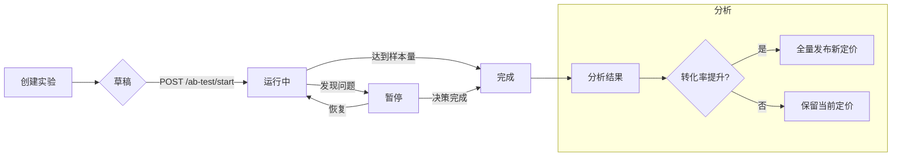

# A/B 定价实验 (A/B Pricing Experiment)

> **项目**: AI 数智名片 (AI Digital Business Card)
> **版本**: v1.0
> **生效日期**: 2026-07-02
> **维护**: Product / Growth Team

---

## 概述

A/B 定价实验用于在标准版（¥99/月）定价基础上测试新的定价策略。通过 50:50 流量分配，对比两组用户的转化率和收入数据，帮助团队做出数据驱动的定价决策。

### 当前实验

| 项目 | 内容 |
|------|------|
| **实验名称** | `standard_v2_2026Q3` |
| **对照组** | ¥99/月 (当前定价) |
| **实验组** | ¥79/月 (新定价策略) |
| **流量分配** | 50:50 |
| **状态** | 草稿 (需手动启动) |

---

## 实验设计

### 实验假设

**H1 (零假设)**: 将标准版定价从 ¥99/月降至 ¥79/月，转化率无显著变化。
**H1 (备择假设)**: 将标准版定价从 ¥99/月降至 ¥79/月，转化率有显著提升。

### 流量分配机制

- 新用户通过 `assign_user_to_variant()` 函数分配
- 基于 `(experiment_name, user_id)` 的哈希值实现**确定性分配**
- 同一用户始终进入同一实验组
- 默认 split: 50% control, 50% variant

### 指标追踪

| 指标 | 说明 |
|------|------|
| **曝光数 (Exposure)** | 用户被分配到实验组的次数 |
| **转化数 (Conversion)** | 用户完成购买/升级的次数 |
| **转化率 (Conversion Rate)** | 转化数 / 曝光数 × 100% |
| **收入 (Revenue)** | 各组产生的总收入 (分) |
| **每用户平均收入 (ARPU)** | 收入 / 曝光数 |

---

## API 接口

### 启动实验

**POST** `/api/subscription/ab-test/start`

启动 A/B 定价实验（将草稿状态切换为运行中）。

**请求示例** (无需 body):

```json
{}
```

**响应示例**:

```json
{
  "success": true,
  "message": "A/B 定价实验已启动",
  "experiment": {
    "name": "standard_v2_2026Q3",
    "description": "标准版定价 A/B 实验 — 对照组 ¥99/月 vs 实验组 ¥79/月",
    "status": "running",
    "traffic_split": 50,
    "control": {
      "name": "control",
      "label": "当前定价 ¥99",
      "price_cents": 9900,
      "price_yuan": "99",
      "metrics": { "exposure_count": 0, "conversion_count": 0, "conversion_rate": 0, "revenue_cents": 0, "avg_revenue_per_user": 0 }
    },
    "variant": {
      "name": "variant",
      "label": "实验定价 ¥79",
      "price_cents": 7900,
      "price_yuan": "79",
      "metrics": { "exposure_count": 0, "conversion_count": 0, "conversion_rate": 0, "revenue_cents": 0, "avg_revenue_per_user": 0 }
    }
  }
}
```

### 查询实验状态

**GET** `/api/subscription/ab-test/status`

返回当前实验的运行状态和累积指标。

**响应示例** (运行中):

```json
{
  "name": "standard_v2_2026Q3",
  "status": "running",
  "traffic_split": 50,
  "control": {
    "label": "当前定价 ¥99",
    "price_yuan": "99",
    "metrics": {
      "exposure_count": 1250,
      "conversion_count": 38,
      "conversion_rate": 3.04,
      "revenue_cents": 376200,
      "avg_revenue_per_user": 300.96
    }
  },
  "variant": {
    "label": "实验定价 ¥79",
    "price_yuan": "79",
    "metrics": {
      "exposure_count": 1238,
      "conversion_count": 52,
      "conversion_rate": 4.2,
      "revenue_cents": 410800,
      "avg_revenue_per_user": 331.83
    }
  }
}
```

---

## 实验流程



---

## 实验决策标准

| 条件 | 决策 |
|------|------|
| 实验组转化率 ≥ 对照组 + 2% (统计显著) | ✅ 全量发布新定价 |
| 实验组转化率 ≈ 对照组 (±0.5%) | 🔄 延长实验，增加样本量 |
| 实验组转化率 < 对照组 | ❌ 保留当前定价 |
| 实验组 ARPU < 对照组 × 0.9 (收入显著下降) | ❌ 即使转化率提升也不发布 |

### 样本量要求

- 最小样本量: 每组至少 500 次曝光
- 建议样本量: 每组至少 2000 次曝光
- 统计显著性水平: p < 0.05

---

## 集成指南

### 分配用户到实验组

```python
from app.services.ab_pricing import assign_user_to_variant

# 用户下单时
variant = assign_user_to_variant(
    experiment_name="standard_v2_2026Q3",
    user_id=user.id,
)

# 根据 variant 显示对应价格
if variant == "variant":
    price = 7900  # ¥79
else:
    price = 9900  # ¥99
```

### 记录转化

```python
from app.services.ab_pricing import record_conversion

# 用户完成支付后
record_conversion(
    experiment_name="standard_v2_2026Q3",
    user_id=user.id,
    variant=variant,
    amount_cents=price,  # 实际支付金额
)
```

---

## 相关文件

| 文件 | 说明 |
|------|------|
| `backend/app/services/ab_pricing.py` | A/B 定价实验服务层 |
| `backend/app/routers/subscription_router.py` | A/B 定价实验 API 端点 |
| `docs/product/AB_PRICING.md` | ⬅️ 本文档 |

---

## 变更历史

| 日期 | 版本 | 变更内容 | 作者 |
|:----:|:----:|----------|:----:|
| 2026-07-02 | v1.0 | 初始版本 — A/B 定价实验框架 | Growth Team |

---

*本文档由 AI 数智名片 Growth 团队维护 | 联系: growth@liankebao.top | 最后更新: 2026-07-02*
