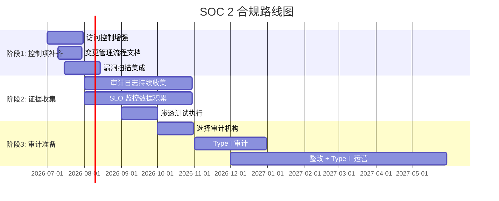

# SOC 2 合规概述

## 文档用途
本文档概述 AI 数字名片项目在 SOC 2 合规方面的当前状态、已实现的控制项、仍需补充的控制项以及合规路线图。

---

## 1. SOC 2 Type I vs Type II

| 维度 | Type I | Type II |
|------|--------|---------|
| **评估对象** | 某一时点的控制设计合理性 | 至少 6 个月的控制运行有效性 |
| **报告内容** | 控制项设计是否满足信任准则 | 控制项在实际运行中是否持续有效 |
| **证据要求** | 设计文档、架构图、策略声明 | 审计日志、运行指标、渗透测试报告、持续监控数据 |
| **适用阶段** | 初期证明控制框架已就绪 | 成熟运营后证明持续合规 |
| **典型周期** | 1–3 个月 | 6–12 个月 |

**当前状态：** 项目已具备 Type I 约 70% 的控制项设计文档；正在积累运营数据以支持 Type II。

## 2. 当前已实现的控制项

- **安全 HTTP 头：** `security_headers.py` 中间件 —— HSTS/X-Content-Type-Options/X-Frame-Options/CSP
- **RBAC：** `rbac.py` + `models/rbac.py` —— 基于角色的访问控制
- **API Key 认证：** `middleware/api_key.py` —— 服务端 API 认证
- **JWT 认证：** `routers/auth.py` —— 用户身份令牌
- **审计日志：** `middleware/audit.py` —— 操作审计记录
- **传输加密：** 全站 TLS（反向代理层配置）
- **静态加密：** 数据库/存储层加密（基础设施层）
- **OpenTelemetry：** `middleware/otel.py` —— 分布式追踪
- **Grafana + SLO：** `slo_tracker.py` —— 服务级别目标监控
- **告警：** `database_monitor.py` —— 数据库健康告警
- **备份：** `scripts/backup.sh` —— 数据库定时备份
- **速率限制：** `middleware/rate_limiter.py` —— API 限流

## 3. 仍需补充的控制项

| 控制域 | 缺失项 | 优先级 | 备注 |
|--------|--------|--------|------|
| **访问控制** | 会话超时 + 空闲断开 | High | 需在认证层实现 |
| **变更管理** | 正式变更审批流程文档 | High | 需定义 CAB 流程 |
| **漏洞管理** | 定期漏洞扫描 + 漏洞生命周期 | High | 需集成 SAST/DAST |
| **安全培训** | 年度安全培训记录 | Medium | 人事流程 |
| **供应商管理** | 第三方风险评估 | Medium | SaaS 依赖方评估 |
| **事件响应** | 正式 IR 计划演练记录 | High | 需定期桌面推演 |
| **数据留存** | 数据分类 + 留存策略文档 | Medium | GDPR/隐私合规 |
| **渗透测试** | 年度第三方渗透测试 | High | 模板已创建 |

## 4. 合规路线图

## 5. 信任准则覆盖矩阵

| 信任准则 | 当前覆盖 | 缺失项 | 目标完成 |
|----------|----------|--------|----------|
| 安全性 | ~65% | 漏洞管理/渗透测试 | 2026-09 |
| 可用性 | ~80% | 正式 DR 测试 | 2026-08 |
| 处理完整性 | ~70% | 数据留存策略 | 2026-08 |
| 保密性 | ~75% | 数据分类 | 2026-07 |
| 隐私性 | ~60% | DSR 流程 | 2026-09 |

---

*最后更新: 2026-06-29*
